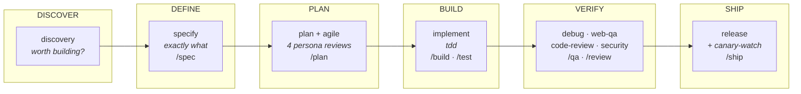

# Skill Forge

**53 engineering skills for AI coding agents — the full software development lifecycle, from idea to production.**

Skill Forge gives your agent the workflows, quality gates, and judgment that senior engineers apply at every phase of building software: validating ideas before building, specifying before coding, reviewing plans from four expert perspectives, implementing test-first, auditing design and security, and shipping with rollback discipline. Every skill is portable, self-contained, and written in one consistent anatomy.



## Quick Start

**Any agent, one command** — via the open `skills` CLI (installs into Claude Code, Cursor, Codex, Copilot, Cline, and 70+ more):

```bash
npx skills add byshahriar/skill-forge              # install all 53 skills
npx skills add byshahriar/skill-forge --list       # browse before installing
npx skills add byshahriar/skill-forge --skill tdd  # just one skill
```

Every skill is **self-contained** — per-skill `references/` travel with a single-skill install; nothing breaks when you cherry-pick. Full registry compatibility details: [docs/skills-sh.md](docs/skills-sh.md).

**Claude Code plugin:**

```
/plugin marketplace add byshahriar/skill-forge
/plugin install skill-forge@skill-forge
```

## Works With

| Agent | Setup |
|---|---|
| **Claude Code** | Plugin install above, or `npx skills add` — commands + skills, full support |
| **Cursor** | [docs/cursor-setup.md](docs/cursor-setup.md) — skills CLI or AGENTS.md + rules pointer |
| **Codex CLI** | [docs/codex-setup.md](docs/codex-setup.md) — skills CLI or native AGENTS.md |
| **GitHub Copilot** | [docs/copilot-setup.md](docs/copilot-setup.md) — skills CLI or `.github/copilot-instructions.md` |
| **Anything else** | Skills are plain markdown + YAML frontmatter — copy `skills/` and point your agent's instruction file at `skills/orchestrator/SKILL.md` |

The repo ships agent-facing entry points for each: [AGENTS.md](AGENTS.md) (Codex, Cursor, Copilot coding agent, and most CLIs read it natively), [CLAUDE.md](CLAUDE.md), and [.github/copilot-instructions.md](.github/copilot-instructions.md).

## The Skills

### Define & Plan
| Skill | What it does |
|---|---|
| [discovery](skills/discovery/SKILL.md) | Validates an idea before anything is built — demand evidence, premise challenge, forced alternatives, design doc |
| [requirements](skills/requirements/SKILL.md) | Requirements interrogation, one question at a time |
| [specify](skills/specify/SKILL.md) | Vague intent → precise, executable spec with verified current state and testable criteria |
| [plan](skills/plan/SKILL.md) | Break approved work into small, atomic, verifiable tasks |
| [ceo-review](skills/ceo-review/SKILL.md) | Founder-mode plan review — challenge premises, find the 10x version, expand or ruthlessly cut scope |
| [eng-review](skills/eng-review/SKILL.md) | Eng-manager plan review — complexity smells, boring-by-default, tests, blast radius |
| [ux-review](skills/ux-review/SKILL.md) | Designer's-eye plan review — hierarchy, empty states, usability laws, trust |
| [dx-review](skills/dx-review/SKILL.md) | Developer-experience review — TTHW benchmarks, seven DX characteristics, journey traces |
| [auto-review](skills/auto-review/SKILL.md) | Runs all four persona reviews sequentially with principled auto-decisions and one final gate |

### Agile
| Skill | What it does |
|---|---|
| [user-stories](skills/user-stories/SKILL.md) | INVEST-checked stories with Given/When/Then criteria; vertical slicing patterns |
| [estimation](skills/estimation/SKILL.md) | Relative sizing with uncertainty flags, spikes, and a calibration loop |
| [sprint-planning](skills/sprint-planning/SKILL.md) | Sprint goal, velocity-based capacity, ~85% commitment, sanity walk |
| [backlog-refinement](skills/backlog-refinement/SKILL.md) | Keep the top of the backlog sprint-ready; prune ruthlessly |
| [standup](skills/standup/SKILL.md) | Honest yesterday/today/blockers generated from real activity |
| [retrospective](skills/retrospective/SKILL.md) | Evidence-based retro from repo data — shipped, patterns, trends, ≤3 owned changes |

### Build
| Skill | What it does |
|---|---|
| [tdd](skills/tdd/SKILL.md) | Strict red-green-refactor with hard gates; testing iron laws; no arbitrary waits |
| [implement](skills/implement/SKILL.md) | One verified vertical slice at a time |
| [api-design](skills/api-design/SKILL.md) | Interfaces designed before implementation |
| [database](skills/database/SKILL.md) | Schema design, zero-downtime migrations, safe backfills, query performance |
| [llm-features](skills/llm-features/SKILL.md) | Eval-driven AI features — golden sets, measured prompt iteration, non-determinism handling |
| [ui-engineering](skills/ui-engineering/SKILL.md) | Frontend engineering standards — state, accessibility, performance |
| [standards](skills/standards/SKILL.md) | Decide the quality bar once, enforce it everywhere |
| [verify](skills/verify/SKILL.md) | Distrust green checkmarks — the completion gate: fresh evidence before any claim |
| [code-research](skills/code-research/SKILL.md) | Read the actual source before building on it |
| [context](skills/context/SKILL.md) | Context budgeting plus save/restore checkpoints |
| [knowledge-base](skills/knowledge-base/SKILL.md) | Durable project learnings that compound across sessions |

### Design
| Skill | What it does |
|---|---|
| [design-system](skills/design-system/SKILL.md) | Full design system consultation → DESIGN.md (aesthetic, type, color, spacing, motion) |
| [design-concepts](skills/design-concepts/SKILL.md) | N genuinely distinct design directions, compared side by side |
| [design-qa](skills/design-qa/SKILL.md) | Live-UI audit: 10 categories, letter grades, AI-slop detection |
| [technical-diagrams](skills/technical-diagrams/SKILL.md) | English → editable mermaid source + rendered diagrams |

### Verify & Debug
| Skill | What it does |
|---|---|
| [debug](skills/debug/SKILL.md) | Systematic debugging — root-cause protocol, pattern table, 3-strike rule |
| [web-qa](skills/web-qa/SKILL.md) | Browser QA — DevTools workflow plus the test→fix→verify sweep |
| [perf](skills/perf/SKILL.md) | Measure-first optimization plus regression benchmarking |
| [incident-response](skills/incident-response/SKILL.md) | Outage response — triage and severity, mitigate before diagnosing, comms cadence, blameless postmortem |
| [code-health](skills/code-health/SKILL.md) | Weighted quality dashboard with trends — plus the agent-environment health lane |

### Review
| Skill | What it does |
|---|---|
| [code-review](skills/code-review/SKILL.md) | Five-axis review plus pre-landing structural pass and fix-first triage |
| [refactor](skills/refactor/SKILL.md) | Simplification — clarity over cleverness |
| [security](skills/security/SKILL.md) | Threat modeling, OWASP patterns, and full CSO-mode audits |

### Ship & Operate
| Skill | What it does |
|---|---|
| [release](skills/release/SKILL.md) | Pre-launch checklist, flags, staged rollout — plus the ship mechanics (merge base → test → version → PR) |
| [canary-watch](skills/canary-watch/SKILL.md) | Post-deploy monitoring against a baseline — alert on changes, not absolutes |
| [ci-cd](skills/ci-cd/SKILL.md) | Pipelines and automated quality gates |
| [git-workflow](skills/git-workflow/SKILL.md) | Branching, commits, versioning, worktree isolation, branch finishing |
| [observability](skills/observability/SKILL.md) | Logs, metrics, traces, alerts as first-class scope |
| [modernization](skills/modernization/SKILL.md) | Deprecation and migration playbooks |
| [resilience](skills/resilience/SKILL.md) | Timeouts, retries with backoff, circuit breakers, idempotency, graceful degradation |

### Docs, Safety & Orchestration
| Skill | What it does |
|---|---|
| [docs](skills/docs/SKILL.md) | ADRs, API docs, READMEs — plus prose quality, reader testing, and post-ship updates |
| [guardrails](skills/guardrails/SKILL.md) | Careful mode (destructive-command warnings) + edit boundaries |
| [orchestrator](skills/orchestrator/SKILL.md) | Routes any request to the right skill; the lifecycle map |
| [multi-agent](skills/multi-agent/SKILL.md) | When and how to fan out subagents — patterns, subagent-driven plan execution, anti-patterns |
| [problem-solving](skills/problem-solving/SKILL.md) | Getting unstuck — simplification cascades, inversion, forced analogies, meta-patterns, scale testing |
| [skill-authoring](skills/skill-authoring/SKILL.md) | TDD for process docs — baseline, pressure-test, and loophole-proof new skills |
| [research](skills/research/SKILL.md) | Six-phase research workflow — primary sources, distillation test, contradiction-safe synthesis |
| [mcp-development](skills/mcp-development/SKILL.md) | High-quality MCP servers — tool design for agents, actionable errors, agent-driven evaluations |

## Commands

| Command | Skill(s) | Purpose |
|---|---|---|
| `/spec` | specify | Turn intent into a precise spec |
| `/plan` | plan | Atomic task breakdown |
| `/build` | implement + tdd | Implement slice by slice |
| `/test` | tdd | Prove behavior with tests |
| `/review` | code-review | Pre-merge review |
| `/ship` | release | Merge base → test → version → PR |
| `/qa` | web-qa | Browser QA sweep |
| `/refactor` | refactor | Simplify |
| `/security` | security | Threat model or CSO audit |
| `/design` | design-system / design-concepts / design-qa | Design work, routed |
| `/standup` | standup | Daily update from real activity |
| `/retro` | retrospective | Evidence-based retro |
| `/discover` | discovery | Validate an idea — three-paths classification, design doc |
| `/debug` | debug | Root cause before any fix |
| `/docs` | docs | ADRs, READMEs, runbooks — reader-tested |
| `/research` | research | Deep-dive an unfamiliar domain |
| `/health` | code-health | Code + agent-environment health dashboard |
| `/stuck` | problem-solving | Dispatch the right unstucking technique |
| `/incident` | incident-response | Production incident — triage, mitigate, comms, postmortem |

## Skill Anatomy

Every skill is one directory with one required file:

```
skills/<name>/
  SKILL.md          # frontmatter (name + description with "Use when…" triggers) + methodology
  references/       # optional, self-contained supporting material
```

Standard sections: Overview · When to Use · workflow · Common Rationalizations · Red Flags · Verification. See [CONTRIBUTING.md](CONTRIBUTING.md) for the full contract; `node scripts/validate-skills.js` enforces it in CI.

## References & Acknowledgments

Skill Forge stands on the shoulders of the agent-skills ecosystem. These projects shaped its content, conventions, and tooling — several skills adapt material from the MIT-licensed packs among them:

| Project | What it contributed |
|---|---|
| [addyosmani/agent-skills](https://github.com/addyosmani/agent-skills) | The skill anatomy (frontmatter contract, rationalization tables, verification checklists) and the engineering-discipline core several Build/Review/Ship skills adapt |
| [garrytan/gstack](https://github.com/garrytan/gstack) | The persona plan-review methodology (CEO/eng/design/DX), discovery diagnostics, design taste, ship mechanics, and safety guardrails several skills distill |
| [obra/superpowers](https://github.com/obra/superpowers) | The iron-law discipline patterns — strict TDD gates, four-phase debugging, verification-before-completion — and TDD-for-process-docs skill authoring |
| [obra/superpowers-skills](https://github.com/obra/superpowers-skills) | The problem-solving technique library (inversion, collision-zone, scale game) and testing anti-patterns |
| [anthropics/skills](https://github.com/anthropics/skills) | The Agent Skills format and reference implementations |
| [vercel-labs/skills](https://github.com/vercel-labs/skills) | The open `skills` CLI and the skills.sh registry this repo targets |
| [tw93/Waza](https://github.com/tw93/Waza) | Inspiration for turning engineering habits into runnable skills |

Thanks to Addy Osmani, Garry Tan, Jesse Vincent, and every contributor to the projects above.

## License

MIT — see [LICENSE](LICENSE).
